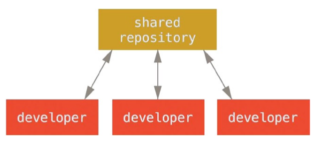
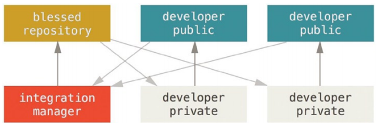

# Distributed Git

## TL;DR

This note is about Distributed Git from the book **Pro Git**

## Authors

Scott Chacon and Ben Straub

## Distributed Workflows

> Unlike Centralized Version Control Systems (CVCSs), the distributed nature of Git allows you to be far more flexible in how developers collaborate on projects
>
> In centralized systems, every dev is a node working more or less equally on a central hub.
>
> In Git, every dev is potentially both a node and a hub.

### Centralized Workflow

### Integration-Manager Workflow

