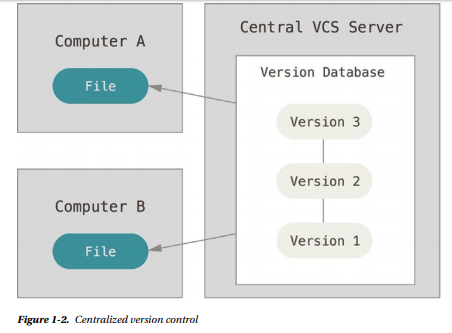
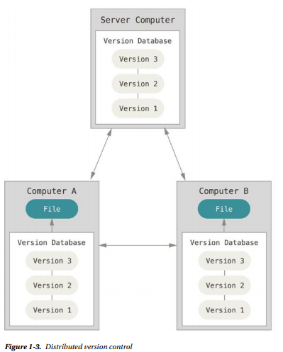
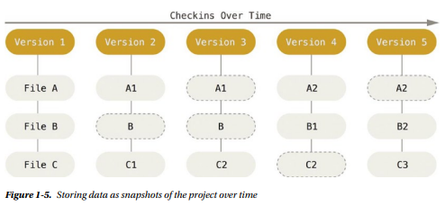
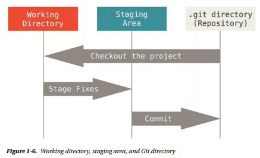
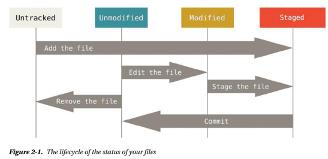

# Git Basics

## TL;DR

This note is about Git Basics from the book **Pro Git**

## Authors

Scott Chacon and Ben Straub

## Intro Version Control Systems

* Centralized Version Control Systems
  
  * Have a single server that contains all the versioned files, and a number of clients that check out files from that central place.
  * 

* Distributed Version Control Systems
  
  * > In a DVCS (such as Git, Mercurial, Bazaar, or Darcs), clients don’t just check out the latest snapshot of the files—they fully mirror the repository. Thus if any server dies, and these systems were collaborating via it, any of the client repositories can be copied back up to the server to restore it. Every checkout is really a full backup of all the data.
  
  * 

## Intro Git

> Git stores and thinks about information much differently than these other systems, even though the user interface is fairly similar, and understanding those differences will help prevent you from becoming confused while using it.

### Snapshots, Not Differences

> The major difference between Git and any other VCS (Subversion and friends included) is the way Git thinks about its data. Conceptually, most other systems store information as a list of file-based changes. These systems (CVS, Subversion, Perforce, Bazaar, and so on) think of the information they keep as a set of files and the changes made to each file over time.
>
> Git doesn’t think of or store its data this way. Instead, Git thinks of its data more like a set of snapshots of a miniature filesystem. Every time you commit, or save the state of your project in Git, it basically takes a picture of what all your files look like at that moment and stores a reference to that snapshot. To be efficient, if files have not changed, Git doesn’t store the file again, just a link to the previous identical file it has already stored. Git thinks about its data more like *a stream of snapshots*.



### Git Has Integrity

> Everything in Git is check-summed before it is stored and is then referred to by that checksum.
>
> The mechanism that Git uses for this checksumming is called a SHA-1 hash. This is a 40-character string composed of hexadecimal characters (0–9 and a–f) and calculated based on the contents of a file or directory structure in Git. A SHA-1 hash looks something like this:

```cplusplus
24b9da6552252987aa493b52f8696cd6d3b00373
```

### The Three States

Git has three main states that your files can reside in:

* Committed: means that the data is safely in your local database.
* Modified: means that you have changed the file but have not committed it to your database yet.
* Staged: means that you have marked a modified file in its current version to go into your next commit snapshot.



## Getting a Git Repository

### Initializing a Repository in an Existing Directory

```git
git init
```

> This creates a new subdirectory named .git that contains all your necessary repository files—a Git repository skeleton

### Cloning an Existing Repository

Clone and store with same name in global repo:

```git
git clone https://github.com/libgits2/libgit2
```

Clone and store with specified name (mylibgit is new name):

```git
git clone https://github.com/libgit2/libgit2 mylibgit
```

## Recording Changes to the Repository

> Each file in your working directory can be in one of two states: tracked or untracked. Tracked files are files that were in the last snapshot; they can be unmodified, modified, or staged. Untracked files are everything else—any files in your working directory that were not in your last snapshot and are not in your staging area.



### Checking the Status of Files

```git
$ git status

On branch master
nothing to commit, working directory clean
```

After creating new file `README.md`, if you run `git status`, you will get:

```git
$ git status

On branch master
Untracked files:
  (use "git add <file>..." to include in what will be committed)

    README.md

nothing added to commit but untracked files present (use "git add" to track)
```

### Tracking New Files

To begin tracking the `README.md` file, you can run this:

```git
git add README.md
```

After running this comman, when you run `git status` again, you will see:

```git
$ git status

On branch master
Changes to be committed:
  (use "git reset HEAD <file>..." to unstage)

    new file: README.md
```

> You can tell that it’s staged because it’s under the Changes to be committed heading.

### Staging Modified Files

After changing the `test.py` file (already tracked), if you run `git status`, you will get something looks like this:

```git
$ git status

On branch master
Changes to be committed:
  (use "git reset HEAD <file>..." to unstage)

    new file: README.md

Changes not staged for commit:
  (use "git add <file>..." to update what will be committed)
  (use "git checkout -- <file>..." to discard changes in working directory)

    modified: test.py
```

When the file appears under a section named `Changed but not staged for commit`, means that a file that is tracked has been modified in the working directory but not yet staged.

To stage this `test.py` file, let's run `git add` and then run `git status` again, you get:

```git
$ git add test.py
$ git status

On branch master
Changes to be committed:
  (use "git reset HEAD <file>..." to unstage)

    new file: README.md
    modified: test.py
```

But suppose you make a new change in `test.py` file and then you run `git status`:

```git
$ git status

On branch master
Changes to be committed:
  (use "git reset HEAD <file>..." to unstage)

    new file: README.md
    modified: test.py

Changes not staged for commit:
  (use "git add <file>..." to update what will be committed)
  (use "git checkout -- <file>..." to discard changes in working directory)

    modified: test.py
```

> Now `test.py` is listed as both staged and unstaged. How is that possible? It turns out that Git stages a file exactly as it is when you run the `git add` command. If you commit now, the version of `test.py` as it was when you last ran the `git add` command is how it will go into the commit, not the version of the file as it looks in your working directory when you run `git commit`. If you modify a file after you run `git add`, you have to run `git add` again to stage the latest version of the file:

```git
$ git add test.py
$ git status

On branch master
Changes to be committed:
  (use "git reset HEAD <file>..." to unstage)

    new file: README.md
    modified: test.py
```