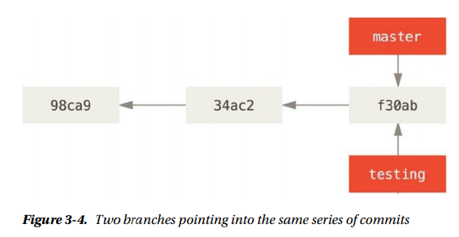
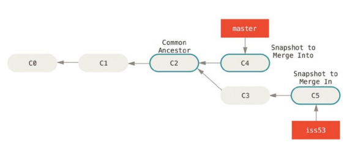
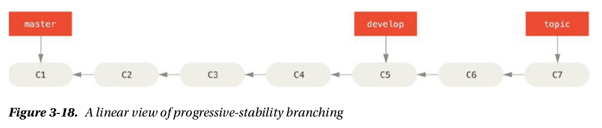
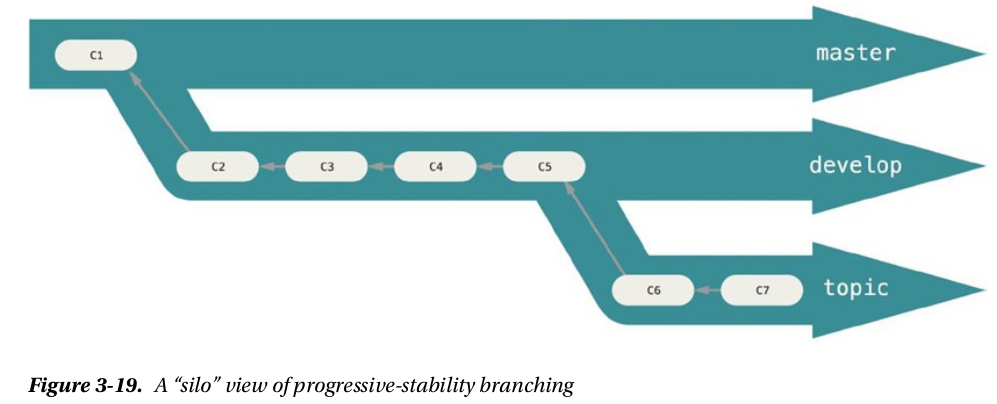
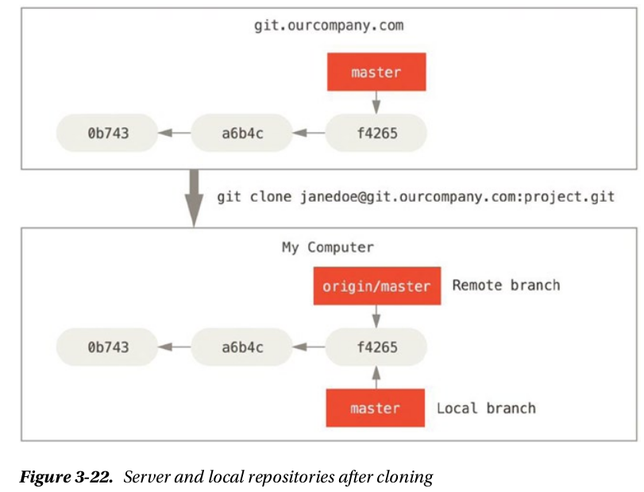
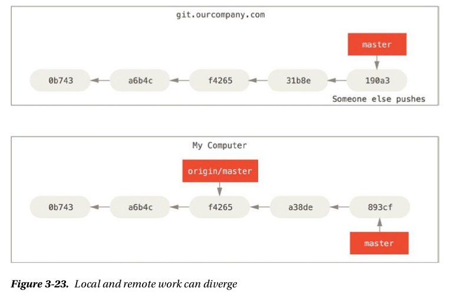
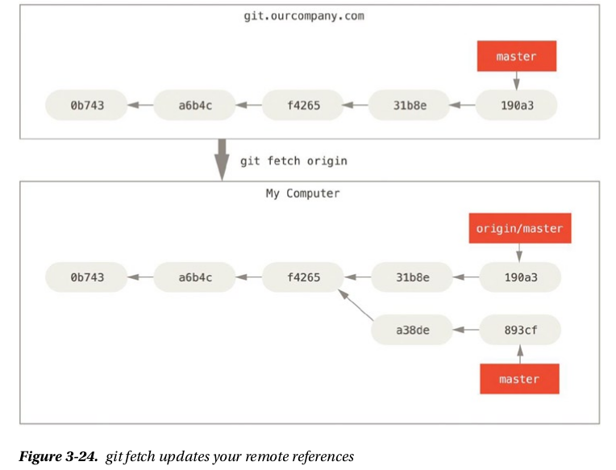

# Git Branching

## TL;DR

This note is about Git Branching from the book **Pro Git**

## Authors

Scott Chacon and Ben Straub

## Branching in a Nutshell

### Create a New Branch

```git
git branch testing
```

This creates a new pointer at the same commit you are currently on:



Git use pointer `HEAD` to keep branch you're currently on.

You can easily see this by running a simple `git log` command that shows you where the branch pointers are pointing. This option is called `--decorate`:

```git
$ git log --oneline --decorate
f30ab (HEAD, master, testing) add feature #32 - ability to add new
34ac2 fixed bug #1328 - stack overflow under certain conditions
98ca9 initial commit of my project
```

### Switching Branches

To switch to an existing branch, use:

```git
git checkout [other-branch]
```

After run above command, HEAD will point to the `[other-branch]` branch.

> **It's important to note that when you switch branches in Git, files in your working directory will change. If you switch to an older branch, your working directory will be reverted to look like it did the last time you committed on that branch. If Git cannot do it cleanly, it will not let you switch at all.**

## Basic Branching and Merging

### Basic Branching

To create a branch and switch to it at the same time, you can run `git checkout` command with `-b` switch (let's say iss53 is the new branch you want to create and switch to):

```git
git checkout -b iss53
```

This code is shorthand for:

```git
git branch iss53
git checkout iss53
```

**This is an important point to remember: when you switch branches, Git resets your working directory to look like it did the last time you committed on that branch. It adds, removes, and modifies files automatically to make sure your working copy is what the branch looked like on your last commit to it.**

After creating a brach and you want to merge this brach to the branch `master` (in case branch `master` is a direct ancestor of your branch), you use:

```git
# Let switch to master branch
$ git checkout master

$ git merge [branch-you-want-to-merge]
# You maybe get something like:
Updating f42c576..3a0874c
Fast-forward
 index.html | 2 ++
 1 file changed, 2 insertions(+)
```

After merging branch to `master`, you will delete branch:

```git
$ git branch -d [branch-you-want-to-delete]
Deleted branch [branch-you-want-to-delete] (...)
```

### Basic Merging

After merging, you will get something like:

```git
$ git checkout master
Switched to branch 'master'
$ git merge iss53
Merge made by the 'recursive' strategy.
README | 1 +
1 file changed, 1 insertion(+)
```

**Merge made by the 'recursive' strategy.** You see that a litle bit different than above case in **Basic Branching**. Because the commit on the branch you're on isn't a direct ancestor of the branch you're merging in, Git has to do some work. In this case, Git does a simple three-way merge, using the two snapshots pointed to by the branch tips and the common ancestor of the two.



Above figure is about three snapshots used in a typical merge

### Basic Merge Conflicts

If having conflicts in your merging, Git won't be able to merge them cleanly. Let's say when you merge branch `iss53` and have conflicts, you maybe get something like:

```git
$ git merge iss53
Auto-merging index.html
CONFLICT (content): Merge conflict in index.html
Automatic merge failed; fix conflicts and then commit the result.
```

> Git hasn't automatically created a new merge commit. It has puased the process while you resolve the conflict.
>
> If you want to see which files are unmerged at any point after a merge conflict, you can run `git status`:

```git
$ git status
On branch master
You have unmerged paths.
 (fix conflicts and run "git commit")
Unmerged paths:
 (use "git add <file>..." to mark resolution)
 both modified: index.html
no changes added to commit (use "git add" and/or "git commit -a")
```

> Anything that has merge conflicts and hasn't been resolved is listed as unmerged. Git adds standard conflict-resolution markers to the files that have conflicts, so you can open them manually and resolve those conflicts. Your file contains a section that looks something like this:

```git
<<<<<<< HEAD:index.html
<div id="footer">contact : email.support@github.com</div>
=======
<div id="footer">
 please contact us at support@github.com
</div>
>>>>>>>iss53:index.html
```

> This means the version in HEAD (your master branch, because that was what you had checked out when you ran your merge command) is the top part of that block (everything above the =======), while the version in your iss53 branch looks like everything in the bottom part. To resolve the conflict, you have to either choose one side or the other or merge the contents yourself. For instance, you might resolve this conflict by replacing the entire block with this:

```git
<div id="footer">
please contact us at email.support@github.com
</div>
```

> This resolution has a little of each section, and the <<<<<<<, =======, and >>>>>>>lines have been completely removed. After you've resolved each of these sections in each conflicted file, run git add on each file to mark it as resolved. Staging the file marks it as resolved in Git.
>
> If you want to use a graphical tool to resolve these issues, you can run git mergetool, which fires up an appropriate visual merge tool and walks you through the conflicts:

```git
$ git mergetool

This message is displayed because 'merge.tool' is not configured.
See 'git mergetool --tool-help' or 'git help config' for more details.
'git mergetool' will now attempt to use one of the following tools:
opendiff kdiff3 tkdiff xxdiff meld tortoisemerge gvimdiff diffuse diffmerge ecmerge p4merge
araxis bc3 codecompare vimdiff emerge
Merging:
index.html
Normal merge conflict for 'index.html':
 {local}: modified file
 {remote}: modified file
Hit return to start merge resolution tool (opendiff):
```

> If you want to use a merge tool other than the default (Git chose opendiff in this case because the command was run on a Mac), you can see all the supported tools listed at the top after one of the following tools. Just type the name of the tool you'd rather use.

After you exit the merge tool, Git asks you whether the merge was successful. If you tell the script that it was, it stages the file to mark it as resolved for you. You can run git status again to verify that all conflicts have been resolved:

```git
$ git status
On branch master
All conflicts fixed but you are still merging.
 (use "git commit" to conclude merge)
Changes to be committed:
 modified: index.html
If you're happy with that, and you verify that everything that had conflicts has been staged, you can type git
commit to finalize the merge commit. The commit message by default looks something like this:
Merge branch 'iss53'
Conflicts:
 index.html
#
# It looks like you may be committing a merge.
# If this is not correct, please remove the file
# .git/MERGE_HEAD
# and try again.
# Please enter the commit message for your changes. Lines starting
# with '#' will be ignored, and an empty message aborts the commit.
# On branch master
# All conflicts fixed but you are still merging.
#
# Changes to be committed:
# modified: index.html
#
```

## Branch Management

The `git branch` command does more than just `create` and `delete` branches. If you run it with no arguments, you get a simple listing of your current branches:

```git
$ git branch
    iss53
*   master
    testing
```

> Notice the * character that prefixes the master branch: it indicates the branch that you currently have checked out (i.e., the branch that HEAD points to).

To see the last commit on each branch, you can run `git branch -v`:

```git
$ git branch -v
    iss53   93b412c fix javascript issue
*   master  7a98805 Merge branch 'iss53'
    testing 782fd34 add scott to the author list in the readmes
```

To see which branches are already merged into the **branch you’re on**, you can run `git branch --merged`:

```git
$ git branch --merged
    iss53
*   master
```

To see all the branches that contain work you haven’t yet merged in, you can run `git branch --no-merged`:

```git
$ git branch --no-merged
    testing
```

This shows your other branch. Because it contains work that isn’t merged in yet, trying to delete it with `git branch –d` will fail:

```git
$ git branch -d testing
error: The branch 'testing' is not fully merged.
If you are sure you want to delete it, run 'git branch -D testing'.
```

So, if you still want to delete branch, you can force it with `-D`.

## Braching Workflows

### Long-Running Branches

> Because Git uses a simple three-way merge, merging from one branch into another multiple times over a long period is generally easy to do. This means you can have several branches that are always open and that you use for different stages of your development cycle; you can merge regularly from some of them into others.
>
> Many Git developers have a workflow that embraces this approach, such as having only code that is entirely stable in their master branch—possibly only code that has been or will be released. They have another parallel branch named develop or next that they work from or use to test stability—it isn’t necessarily always stable, but whenever it gets to a stable state, it can be merged into master. It’s used to pull in topic branches (short-lived branches, like your earlier iss53 branch) when they’re ready, to make sure they pass all the tests and don’t introduce bugs.
>
> In reality, we’re talking about pointers moving up the line of commits you’re making. The stable branches are farther down the line in your commit history, and the bleeding-edge branches are farther up the history.



> It's generally easier to think about them as work silos, where sets of commits graduate to a more stable silo when they are fully tested



### Topic Branches

> Topic branches, however, are useful in porjects of any size. A topic branch is a short-lived branch that you create and use for a single particular feature or related work.

## Remote Branches

> Remote branches are references (pointers) to the state of branches in your remote repositories. They’re local branches that you can’t move; they’re moved automatically for you whenever you do any network communication. Remote branches act as bookmarks to remind you where the branches on your remote repositories were the last time you connected to them.
>
> They take the form (remote)/(branch). For instance, if you wanted to see what the master branch on your origin remote looked like as of the last time you communicated with it, you would check the origin/master branch. If you were working on an issue with a partner and they pushed up an iss53 branch, you might have your own local iss53 branch; but the branch on the server would point to the commit at origin/iss53.
>
> This may be a bit confusing, so let’s look at an example. Let’s say you have a Git server on your network at git.ourcompany.com. If you clone from this, Git’s clone command automatically names it origin for you, pulls down all its data, creates a pointer to where its master branch is, and names it origin/master locally. Git also gives you your own local master branch starting at the same place as origin’s master branch, so you have something to work from.
>
> **"Origin" is not special. Just like the branch name “master” does not have any special meaning in Git, neither does “origin”. While “master” is the default name for a starting branch when you run git init which is the only reason it’s widely used, “origin” is the default name for a remote when you run git clone . If you run git clone -o booyah instead, then you will have booyah/master as your default remote branch.**



> If you do some work on your local master branch, and, in the meantime, someone else pushes to git.ourcompany.com and updates its master branch, then your histories move forward differently. Also, as long as you stay out of contact with your origin server, your origin/master pointer doesn’t move.



> To synchronize your work, you run a git fetch origin command. This command looks up which server “origin” is (in this case, it’s git.ourcompany.com), fetches any data from it that you don’t yet have, and updates your local database, moving your origin/master pointer to its new, more up-to-date position.



### Pushing

```git
git push [remote] [branch]

git push origin test_branching
```

When you push to server (global) repo, you need type your password for authentification.

> **Don’t type your password every time. If you’re using an HTTPS URL to push over, the Git server will ask you for your username and password for authentication. By default it will prompt you on the terminal for this information so the server can tell if you’re allowed to push. If you don’t want to type it every single time you push, you can set up a “credential cache.” The simplest is just to keep it in memory for a few minutes, which you can easily set up by running `git config --global credential.helper cache`.**
