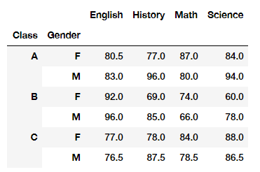
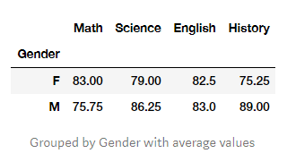
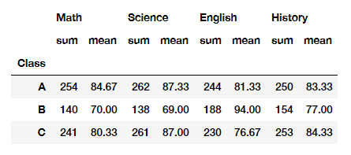

# Basic Pandas

## TL;DR

This note contains some basic modules in Pandas.

## Link Article

https://towardsdatascience.com/pandas-cheat-sheet-4c4eb6802a4b

And from me.

## Key Takeaways

### Head

To view `n` first rows of `DataFrame`

```python
df.head() # default 5 first rows

df.head(n=10) # view 10 first rows
```

### Tail

To view `n` last rows of `DataFrame`

```python
df.tail() # default 5 last rows

df.tail(n=10) # view 10 last rows
```

### Column

How to get column name $\to$ `df.cloumns`

How to rename columns:

```python
# Using inplace means making change to itself.
df.rename(columns = {'old_column_name':'new_column_name'}, inplace = True)

# If we don't state inplace as True we need to save it back to itself manually
df = df.rename(columns = {'old_column_name':'new_column_name'})
```

How to get subset columns:

```python
# subseting a column as a series
df['Math']

# subseting as a dataframe
df[['Math']]

# multiple columns
df[['Math', 'History']]
```

How to add column:
> Adding more columns to a dataframe is as simple as creating a new column name and setting the values equal to it.

```python
df['new_column'] = value_of_new_column
```

How to reorder columns:
> If we wanted to reorder the columns, we can create a list of the order we want the dataframe columns to be in, and index them on the dataframe.

```python
# Have old order: column_2 column_4 column_1 column_3
new_order = ['column_1', 'column_2', 'column_3', 'column_4']

# Overwrite the old dataframe with the same dataframe but new column order
df = df[new_order]
```

### Shape

To get the shape of `DataFrame` (? rows, ? columns) $\to$ `df.shape`.

### Info

To view info of `DataFrame` (datatype, null or not null values, row, column,...) $\to$ `df.info()`

### Describe

To observe the count, mean, standard deviation, quantities, min, and max:

```python
df.describe().round(2) # use .round(2) for 15.789 --> 15.79
```

### Quantile

> Using the .describe() function we automatically got quantiles for 25, 50, and 75. We can also state our own quantiles. Below I have selected 10%, 40%, and 70%. Note — we can pass in as many quantiles in the formula below.

```python
df.quantile([0.1,0.4,0.7, 0.8, 0.9])
```

### Mean, Standard Deviation, Variance, Count, Median, Min, and Max

> We can use a variety of functions on the dataframe to get an aggregated result. You can also pass in a column name to retrieve that column value only.

```python
# mean
df.mean()
df['Math'].mean()

# standard deviation
df.std()
df['Math'].std()

# variance
df.var()
df['Math'].var()

# count
df.count()
df['Math'].count()

# median
df.median()
df['Math'].median()

# min
df.min()
df['Math'].min()

# max
df.max()
df['Math'].max()
```

### Index Subsetting — iloc

```python
df.iloc[0]           # first column
df.iloc[[0]]         # frist row
df.iloc[:, 1]        # all rows second column
df.iloc[3, 1]        # 4th row second column only
df.iloc[[1,3], :]    # row 1 and 3, with all columns
df.iloc[:, 1:3]      # all rows and columns 1 to 3 (*not                              including 3)
df.iloc[4:, : 3]     # from row 5 till last row, and first col to 4th col (not including 4th)
```

### Location Subsetting — loc

```python
df.loc[:, 'column_1']                  # all rows in column_1 column
df.loc[2:3, ['column_1', 'column_2']]   # rows 3 and 4, for column_1 and column_2
df.loc[4:, 'column_1': 'column_5']      # row 5 onwards, and column_1 TO column_5
df.loc[:5, 'column_2': ]
```

### Boolean Indexing

How to use:

```python
dataframe[dataframe['column_name'] == 'filter_objective']
```

Example:

```python
# boolean subseting
df[df['Math'] > 80]

# subsetting but only calling a column
df[df['Math'] > 80]['Science']

# subsetting but only calling a column using iloc
df[df['Math'] > 80].iloc[:, 3]

# AND  conditions
df[(df['Math'] > 80) & (df['Science'] < 80)]

# OR conditions but only want History score
df[(df['Math'] > 80) | (df['Science'] < 80)]['History']
```

### Sort values

> If we want to sort our dataframe based on a specific value, we can use sort_values() by default values are sorted in ascending, we can pass in a False parameter to change it to descending.

```python
# sort by a column - default asc
df.sort_values('Math')
df.sort_values('Math', ascending = False)
```

### Concat

> Using concat, we can merge two data frames together based on an axis. For example, we can add new values to our dataframe in two scenarios.
>
> 1. Add more rows — axis = 0
> 2. Add more columns — axis = 1

```python
# attach dataframes together, reset index and drop the index col
pd.concat([df, df2], axis = 0).reset_index(drop=True)
```

### Pivot Table

> A pivot table is a table of statistics that summarizes the data of a more extensive table (such as from a database, spreadsheet, or business intelligence program). This summary might include sums, averages, or other statistics, which the pivot table groups together in a meaningful way.

Example:

```python
df.pivot_table(index= ['Class','Gender'])
```

We get result:



### Group By

> A groupby operation involves some combination of splitting the object, applying a function, and combining the results. This can be used to group large amounts of data and compute operations on these groups.

Basic groupby

```python
# groupby combined with aggreagate function
df.groupby(by ='Gender').mean()
```

We get result:



Groupby with aggregate functions

```python
# groupby and adding several funcitons with agg
df.groupby(by ='Class').agg(['sum', 'mean']).round(2)
```

We get result:


