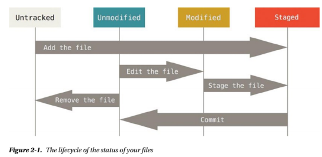

# Git Basics

## TL;DR

This note is about Git Basics from the book **Pro Git**

## Authors

Scott Chacon and Ben Straub

## Intro Version Control Systems

* Centralized Version Control Systems
  
  * Have a single server that contains all the versioned files, and a number of clients that check out files from that central place.
  * 

* Distributed Version Control Systems
  
  * > In a DVCS (such as Git, Mercurial, Bazaar, or Darcs), clients don’t just check out the latest snapshot of the files—they fully mirror the repository. Thus if any server dies, and these systems were collaborating via it, any of the client repositories can be copied back up to the server to restore it. Every checkout is really a full backup of all the data.
  
  * 

## Intro Git

> Git stores and thinks about information much differently than these other systems, even though the user interface is fairly similar, and understanding those differences will help prevent you from becoming confused while using it.

### Snapshots, Not Differences

> The major difference between Git and any other VCS (Subversion and friends included) is the way Git thinks about its data. Conceptually, most other systems store information as a list of file-based changes. These systems (CVS, Subversion, Perforce, Bazaar, and so on) think of the information they keep as a set of files and the changes made to each file over time.
>
> Git doesn’t think of or store its data this way. Instead, Git thinks of its data more like a set of snapshots of a miniature filesystem. Every time you commit, or save the state of your project in Git, it basically takes a picture of what all your files look like at that moment and stores a reference to that snapshot. To be efficient, if files have not changed, Git doesn’t store the file again, just a link to the previous identical file it has already stored. Git thinks about its data more like *a stream of snapshots*.


### Git Has Integrity

> Everything in Git is check-summed before it is stored and is then referred to by that checksum.
>
> The mechanism that Git uses for this checksumming is called a SHA-1 hash. This is a 40-character string composed of hexadecimal characters (0–9 and a–f) and calculated based on the contents of a file or directory structure in Git. A SHA-1 hash looks something like this:

```cplusplus
24b9da6552252987aa493b52f8696cd6d3b00373
```

### The Three States

Git has three main states that your files can reside in:

* Committed: means that the data is safely in your local database.
* Modified: means that you have changed the file but have not committed it to your database yet.
* Staged: means that you have marked a modified file in its current version to go into your next commit snapshot.


## First-Time Git Setup

### Your Identity

```git
git config --global user.name "Your Name"

git config --global user.email your_email@email.com
```

### Your Editor

Git uses Vim for default editor, but you can change to other editor:

```git
git config --global core.editor emacs
```

### Checking Your Settings

```list
$ git config --list

user.name=Your Name
user.email=your_email@email.com
color.status=auto
color.branch=auto
color.interactive=auto
color.diff=auto
...
```

You can also check what Git thinks a specific key's value is by typing `git config <key>`:

```git
$ git config user.name

Your Name
```

## Getting Help

You can use three ways to get the manual page (manpage) help for any of the Git commands:

```git
git help <verb>
git <verb> --help
man git-<verb>
```

## Getting a Git Repository

### Initializing a Repository in an Existing Directory

```git
git init
```

> This creates a new subdirectory named .git that contains all your necessary repository files—a Git repository skeleton

### Cloning an Existing Repository

Clone and store with same name in global repo:

```git
git clone https://github.com/libgits2/libgit2
```

Clone and store with specified name (mylibgit is new name):

```git
git clone https://github.com/libgit2/libgit2 mylibgit
```

## Recording Changes to the Repository

> Each file in your working directory can be in one of two states: tracked or untracked. Tracked files are files that were in the last snapshot; they can be unmodified, modified, or staged. Untracked files are everything else—any files in your working directory that were not in your last snapshot and are not in your staging area.



### Checking the Status of Files

```git
$ git status

On branch master
nothing to commit, working directory clean
```

After creating new file `README.md`, if you run `git status`, you will get:

```git
$ git status

On branch master
Untracked files:
  (use "git add <file>..." to include in what will be committed)

    README.md

nothing added to commit but untracked files present (use "git add" to track)
```

### Tracking New Files

To begin tracking the `README.md` file, you can run this:

```git
git add README.md
```

After running this comman, when you run `git status` again, you will see:

```git
$ git status

On branch master
Changes to be committed:
  (use "git reset HEAD <file>..." to unstage)

    new file: README.md
```

> You can tell that it’s staged because it’s under the Changes to be committed heading.

### Staging Modified Files

After changing the `test.py` file (already tracked), if you run `git status`, you will get something looks like this:

```git
$ git status

On branch master
Changes to be committed:
  (use "git reset HEAD <file>..." to unstage)

    new file: README.md

Changes not staged for commit:
  (use "git add <file>..." to update what will be committed)
  (use "git checkout -- <file>..." to discard changes in working directory)

    modified: test.py
```

When the file appears under a section named `Changed but not staged for commit`, means that a file that is tracked has been modified in the working directory but not yet staged.

To stage this `test.py` file, let's run `git add` and then run `git status` again, you get:

```git
$ git add test.py
$ git status

On branch master
Changes to be committed:
  (use "git reset HEAD <file>..." to unstage)

    new file: README.md
    modified: test.py
```

But suppose you make a new change in `test.py` file and then you run `git status`:

```git
$ git status

On branch master
Changes to be committed:
  (use "git reset HEAD <file>..." to unstage)

    new file: README.md
    modified: test.py

Changes not staged for commit:
  (use "git add <file>..." to update what will be committed)
  (use "git checkout -- <file>..." to discard changes in working directory)

    modified: test.py
```

> Now `test.py` is listed as both staged and unstaged. How is that possible? It turns out that Git stages a file exactly as it is when you run the `git add` command. If you commit now, the version of `test.py` as it was when you last ran the `git add` command is how it will go into the commit, not the version of the file as it looks in your working directory when you run `git commit`. If you modify a file after you run `git add`, you have to run `git add` again to stage the latest version of the file:

```git
$ git add test.py
$ git status

On branch master
Changes to be committed:
  (use "git reset HEAD <file>..." to unstage)

    new file: README.md
    modified: test.py
```

### Short Status

You can get a short status if you run `git status -s` or `git status --short`:

```git
$ git status -s

 M README
MM Rakefile
A  lib/git.rb
M  lib/simplegit.rb
?? LICENSE.txt
```

`??` for new files that aren't tracked.

`A` for new files that have been added to the staging area.

`M` for modified files.

`MM` for modified, staged and then modifed again (both staged and unstaged).

### Ignoring Files

> Often, you’ll have a class of files that you don’t want Git to automatically add or even show you as being untracked.
> These are generally automatically generated files such as log files or files produced by your build system.
> In such cases, you can create a file listing patterns to match them named `.gitignore`. Here is an example `.gitignore` file:

```git
$ cat .gitignore

*.[oa]
*~
```

In first line tells Git to ignore any files ending in ".o" or ".a".
The second line tells Git to ignore all files that end with a tilde (~).

The rules for the patterns you can put in the `.gitignore` file are as follows:

* Blank lines o lines starting with `#` are ignored.
* Standard glob patterns work. (Glob patterns are like simplified regular expressions that shells use. Besides, you can also use two asterisks to match nested directories; `a/**/z` would match
`a/z`, `a/b/z`, `a/b/c/z`, and so on)
* You can end patterns with a forward slash (/) to specify a directory.
* You can negate a pattern by starting it with an exclamation point (!).

Here is another example of `.gitignore` file:

```git
# a comment - this is ignored
*.a       # no .a files
!lib.a    # but do track lib.a, even though you're ignoring .a files above
/TODO     # only ignore the root TODO file, not subdir/TODO
build/    # ignore all files in the build/ directory
doc/*.txt # ignore doc/notes.txt, but not doc/server/arch.txt
```

### Viewing Your Staged and Unstaged Changes

To see what you’ve changed but not yet staged, type git diff with no other arguments:

```git
git diff
```

To see what you’ve staged that will go into your next commit, you can use:

```git
git diff --staged
```

This command compares your staged changes to your last commit.

> It’s important to note that git diff by itself doesn’t show all changes made since your last commit—only changes that are still unstaged. This can be confusing, because if you’ve staged all your changes, git diff will give you no output.

To see what you’ve staged so far:

```git
git diff -cached
```

### Committing Your Changes

To commit your change, you use:

```git
git commit -m "Your message"
```

### Skipping the Staging Area

> Adding the `-a` option to the `git commit` command makes Git automatically stage every file that is already tracked before doing the commit, letting you skip the `git add` part:

```git
$ git status
On branch master
Changes not staged for commit:
 (use "git add <file>..." to update what will be committed)
 (use "git checkout -- <file>..." to discard changes in working directory)

   modified: benchmarks.rb

no changes added to commit (use "git add" and/or "git commit -a")

$ git commit -a -m "added new benchmarks"
[master 83e38c7] added new benchmarks
 1 file changed, 5 insertions(+), 0 deletions(-)
```

### Removing Files

> If you simply remove the file from your working directory, it shows up under the “Changed but not updated” (that is, unstaged) area of your `git status` output.
>
> Then, if you run `git rm`, it stages the file’s removal:

```git
$ git rm grit.gemspec
rm 'grit.gemspec'

$ git status
On branch master
Changes to be committed:
 (use "git reset HEAD <file>..." to unstage)

   deleted: grit.gemspec
```

> **Another useful thing you may want to do is to keep the file in your working tree but remove it from your staging area. In other words, you may want to keep the file on your hard drive but not have Git track it anymore. This is particularly useful if you forgot to add something to your .gitignore file and accidentally added it, like a large log file or a bunch of .a compiled files. To do this, use the `--cached` option**

```git
git rm --cached README.md
```

> You can pass files, directories, and file-glob patterns to the git rm command. That means you can do things such as:

```git
# Remove all files that have the `.log`extension in the `log/`directory
git rm log/\*.log

# Remove all files that end with ~
git rm \*~
```

### Moving Files (Rename Files)

> Unlike many other VCS systems, Git doesn’t explicitly track file movement. If you rename a file in Git, no metadata is stored in Git that tells it you renamed the file

If you want to rename a file in Git, you can run something like:

```git
git mv file_src file_dest
```

## Viewing the Commit History

To look back to see what has happened:

```git
git log
```

To show the difference introduced in each commit (in `git log`), you use `-p` flag and `-2` (limits the output to only the last two entries):

```git
git log -p -2
```

To see some abbreviated stats for each
commit, you can use the `--stat` option:

```git
git log --stat
```

To change the log output to formats other than the default:

```git
git log --pretty=oneline
```

In this, `oneline` option prints each commit on a single line, which is useful if you’re looking at a lot of commits. You can use other option, such as: `short`, `full`, and `fuller`.

Or use `--pretty` with your format:

```git

$ git log --pretty=format:"%h - %an, %ar : %s"

ca82a6d - Scott Chacon, 6 years ago : changed the version number
085bb3b - Scott Chacon, 6 years ago : removed unnecessary test
a11bef0 - Scott Chacon, 6 years ago : first commit
```

| Option        | Description of Output |
|:------------- |:-------------         |
| %H | Commit hash |
|%h | Abbreviated commit hash|
|%T | Tree hash|
|%t | Abbreviated tree hash|
|%P | Parent hash|
|%p | Abbreviated parent hash|
|%an | Author name|
|%ae | Author e-mail|
|%ad | Author date (format respects the –date= option|
|%ar | Author date, relative|
|%cn | Committer name|
|%ce | Committer e-mail|
|%cd | Committer date|
|%cr | Committer date, relative|
|%s | Subject         |

Table 2-1. Useful Options for git log --pretty=format

The oneline and format options are particularly useful with another log option called `--graph`. This option adds a nice little ASCII graph showing your branch and merge history:

```git
$ git log --pretty=format:"%h %s" --graph

* 2d3acf9 ignore errors from SIGCHLD on trap
* 5e3ee11 Merge branch 'master' of git://github.com/dustin/grit
|\
| * 420eac9 Added a method for getting the current branch.
* | 30e367c timeout code and tests
* | 5a09431 add timeout protection to grit
* | e1193f8 support for heads with slashes in them
|/
* d6016bc require time for xmlschema
* 11d191e Merge branch 'defunkt' into local
```

| Option        | Description |
|:------------- |:------------- |
|-p | Show the patch introduced with each commit.|
|--stat | Show statistics for files modified in each commit.|
|--shortstat | Display only the changed/insertions/deletions line from the --stat command.|
|--name-only | Show the list of files modified after the commit information.|
|--name-status | Show the list of files affected with added/modified/deleted information as well.|
|--abbrev-commit | Show only the first few characters of the SHA-1 checksum instead of all 40.|
|--relative-date | Display the date in a relative format (for example, “2 weeks ago”) instead of using the full date format.|
|--graph | Display an ASCII graph of the branch and merge history beside the log output.|
|--pretty | Show commits in an alternate format. Options include oneline, short, full, fuller, and format (where you specify your own format).|

### Limiting Log Output

```git
git log --since=2.weeks
```

> This command works with lots of formats—you can specify a specific date like "2008-01-15", or a relative date such as "2 years 1 day 3 minutes ago". And you also use `--until` option like `since`.

You also can filter the list to commits that match some search criteria, such as `--author` (filter on a specific author), `--grep` (search for keywords in the commit messages).

If you want to specify both options (option 1 **AND** option 2), you have to add `--all-match` or the command will match commits with either (option 1 **OR** option 2).

> Another really helpful filter is the -S option that takes a string and only shows the commits that introduced a change to the code that added or removed that string. For instance, if you wanted to find the last commit that added or removed a reference to a specific function, you could call:

```git
git log --Sfunction_name
```

| Option        | Description |
|:------------- |:------------- |
|-(n) Show only the last n commits
|--since, --after | Limit the commits to those made after the specified date|
|--until, --before | Limit the commits to those made before the specified date|
|--author | Only show commits in which the author entry matches the specified string|
|--committer | Only show commits in which the committer entry matches the specified string|
|--grep | Only show commits with a commit message containing the string|
|-S | Only show commits adding or removing code matching the string |

Table 2-3. Options to Limit the output of git log

## Undoing Things

```git
git commit -amend
```

> This command takes your staging area and uses it for the commit. If you’ve made no changes since your last commit (for instance, you run this command immediately after your previous commit), then your snapshot will look exactly the same, and all you’ll change is your commit message.
>
> The same commit-message editor fires up, but it already contains the message of your previous commit. You can edit the message the same as always, but it overwrites your previous commit.
>
> As an example, if you commit and then realize you forgot to stage the changes in a file you wanted to add to this commit, you can do something like this:

```git
git commit -m 'initial commit'
git add forgotten_file
git commit --amend
```

### Unstaging a Staged File

After typing `git add .` if you want to unstage one of all files, you can use:

```git
git reset HEAD file_name.txt
```

This command unstage the file_name.txt file.

### Unmodifying a Modified File

Let's say that after chaging your file, you relize that you don't want keep your changes in the file_name.txt. You can use the following command:

```git
git checkout -- file_name.txt
```

> **__Important__: It’s important to understand that git checkout -- [file] is a dangerous command. Any changes you made to that file are gone—you just copied another file over it. Don’t ever use this command unless you absolutely know that you don’t want the file.**

## Working with Remotes

### Showing Your Remotes

```git
$ git remote
origin

$ git remote -v
origin https://github.com/ptpuyen1511/my_notes (fetch)
origin https://github.com/ptpuyen1511/my_notes (push)
```

Using `-v` for shows you the URLs that Git has stored for the shortname to be used when reading and writing with several collaborations.

### Adding Remote Repositories

```git
$ git remote
origin

$ git remote add new_remote https://github.com/new_user/my_notes

$ git remote -v
origin https://github.com/ptpuyen1511/my_notes (fetch)
origin https://github.com/ptpuyen1511/my_notes (push)
new_remote https://github.com/new_user/my_notes (fetch)
new_remote https://github.com/new_user/my_notes (push)
```

### Fetching and Pulling from Your Remotes

```git
get fetch [remote-name]
```

> The command goes out to that remote project and pulls down all the data from that remote project that you don’t have yet. After you do this, you should have references to all the branches from that remote, which you can merge in or inspect at any time.

### Pushing to Your Remotes

```git
git push [remote-name] [branch-name]
```

### Inspecting a Remote

```git
git remote show [remote-name]
```

### Removing and Renaming Remotes

Renaming remotes:

```git
git remote rename [old-name] [new-name]
```

Removing remotes:

```git
git remote rm [remote-name]
```

## Tagging

### Listing Your Tags

```git
$ git tag
v0.1
v0.2
```

If you’re only interested in looking at the 1.8.5 series, you can run this:

```git
$ git tag -l 'v1.8.5*'
v1.8.5
v1.8.5-rc0
v1.8.5-rc1
v1.8.5-rc2
v1.8.5-rc3
v1.8.5.1
v1.8.5.2
v1.8.5.3
v1.8.5.4
v1.8.5.5
```

### Creating Tags

> Git uses two main types of tags:
>
>* A lightweight tag is very much like a branch that doesn’t change—it’s just a pointer to a specific commit.
>* Annotated tags, however, are stored as full objects in the Git database. They’re checksummed; contain the tagger name, e-mail, and date; have a tagging message; and can be signed and verified with GNU Privacy Guard (GPG). It’s generally recommended that you create annotated tags so you can have all this information; but if you want a temporary tag or for some reason don’t want to keep the other information, lightweight tags are available too.

### Annotated Tags

```git
$ git tag -a v1.4 -m "my version 1.4"

$ git tag
v0.1
v1.3
v1.4
```

You can see the tag data along with the commit that was tagged by using the `git show` command:

```git
$ git show v1.4
tag v1.4
Tagger: Ben Straub <ben@straub.cc>
Date: Sat May 3 20:19:12 2014 -0700

my version 1.4

commit ca82a6dff817ec66f44342007202690a93763949
Author: Scott Chacon <schacon@gee-mail.com>
Date: Mon Mar 17 21:52:11 2008 -0700

    changed the verison number
```

### Lightweight Tags

> Another way to tag commits is with a lightweight tag. This is basically the commit checksum stored in a file—no other information is kept. To create a lightweight tag, **don’t** supply the `-a`, `-s`, or `-m` option:

```git
$ git tag v1.4-lw

$ git tag
v0.1
v1.3
v1.4
v1.4-lw
v1.5
```

> This time, if you run `git show` on the tag, you don’t see the extra tag information. The command just shows the commit:

```git
$ git show v1.4-lw

commit ca82a6dff817ec66f44342007202690a93763949
Author: Scott Chacon <schacon@gee-mail.com>
Date: Mon Mar 17 21:52:11 2008 -0700

    changed the verison number

```

### Tagging Later

You can also tag commits after you’ve moved past them. Suppose your commit history looks like this:

```git
$ git log --pretty=oneline
15027957951b64cf874c3557a0f3547bd83b3ff6 Merge branch 'experiment'
a6b4c97498bd301d84096da251c98a07c7723e65 beginning write support
0d52aaab4479697da7686c15f77a3d64d9165190 one more thing
6d52a271eda8725415634dd79daabbc4d9b6008e Merge branch 'experiment'
0b7434d86859cc7b8c3d5e1dddfed66ff742fcbc added a commit function
4682c3261057305bdd616e23b64b0857d832627b added a todo file
166ae0c4d3f420721acbb115cc33848dfcc2121a started write support
9fceb02d0ae598e95dc970b74767f19372d61af8 updated rakefile
964f16d36dfccde844893cac5b347e7b3d44abbc commit the todo
8a5cbc430f1a9c3d00faaeffd07798508422908a updated readme
```

> Now, suppose you forgot to tag the project at v1.2, which was at the “updated rakefile” commit. You can add it after the fact. To tag that commit, you specify the commit checksum (or part of it) at the end of the command:

```git
$ git tag -a v1.2 9fceb02

$ git tag
v0.1
v1.2
v1.3
v1.4
v1.4-lw
v1.5

$ git show v1.2
tag v1.2
Tagger: Scott Chacon <schacon@gee-mail.com>
Date: Mon Feb 9 15:32:16 2009 -0800

version 1.2
commit 9fceb02d0ae598e95dc970b74767f19372d61af8
Author: Magnus Chacon <mchacon@gee-mail.com>
Date: Sun Apr 27 20:43:35 2008 -0700

    updated rakefile
```

### Sharing Tags

> By default, the git push command **doesn’t transfer tags** to remote servers. You will have to explicitly push tags to a shared server after you have created them. This process is just like sharing remote branches—you can run git push origin [tagname].

```git
$ git push origin v1.5

Counting objects: 14, done.
Delta compression using up to 8 threads.
Compressing objects: 100% (12/12), done.
Writing objects: 100% (14/14), 2.05 KiB | 0 bytes/s, done.
Total 14 (delta 3), reused 0 (delta 0)
To git@github.com:schacon/simplegit.git
 * [new tag] v1.5 -> v1.5
```

Use option `--tags` for transfers all your tags that are not already there to the remote server:

```git
$ git push origin --tags

Counting objects: 1, done.
Writing objects: 100% (1/1), 160 bytes | 0 bytes/s, done.
Total 1 (delta 0), reused 0 (delta 0)
To git@github.com:schacon/simplegit.git
 * [new tag] v1.4 -> v1.4
 * [new tag] v1.4-lw -> v1.4-lw
```

### Git Aliases

```git
git config --global alias.co checkout
git config --global alias.br branch
git config --global alias.ci commit
git config --global alias.st status
```

```git
git config --global alias.unstage 'reset HEAD --'

// Two following commands equivalent
git unstage fileA
git reset HEAD fileA
```

```git
$ git config --global alias.last "log -1 HEAD"

$ git last
commit 66938dae3329c7aebe598c2246a8e6af90d04646
Author: Josh Goebel <dreamer3@example.com>
Date: Tue Aug 26 19:48:51 2008 +0800
 test for current head
 Signed-off-by: Scott Chacon <schacon@example.com>
```

If  you want to run an external command, rather than a Git subcommand. In that case, you start the command with a ! character. This is useful if you write your own tools that work with a Git repository. We can demonstrate by aliasing git visual to run `gitk`:

```git
git config --global alias.visual "!gitk"
```
